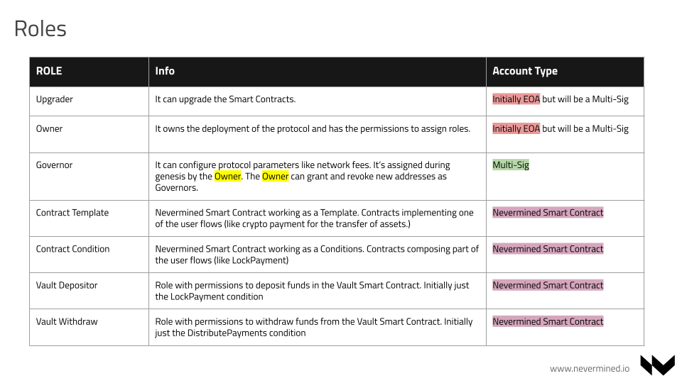
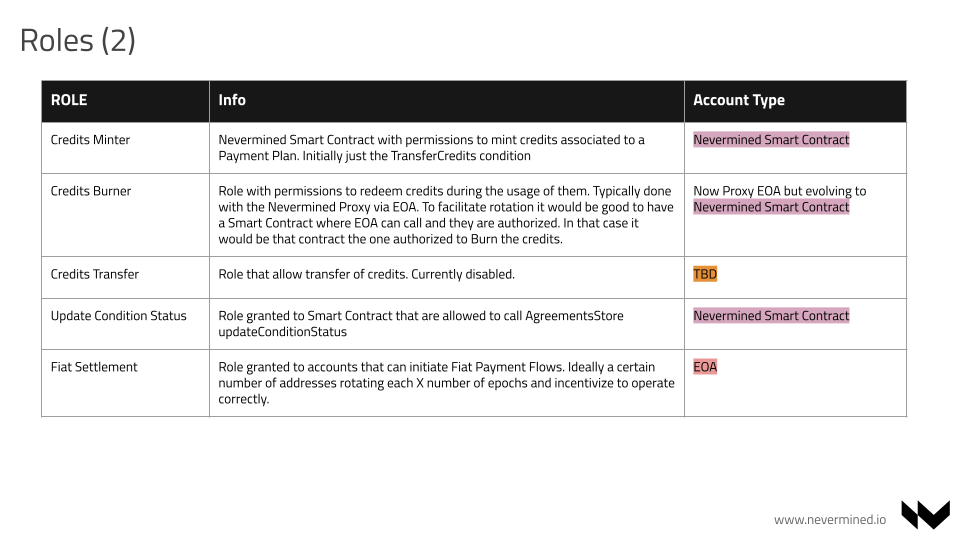

# Smart Contracts Security

## Roles and Responsibilities




## Solidity Compiler

The protocol uses the latest stable version of the Solidity compiler. The code is written in Solidity 0.8.x, which includes several improvements and security features over previous versions.

## Libraries

The protocol uses OpenZeppelin libraries for the implementation of the Smart Contracts. The main external functionalities integrated via OpenZeppeling libraries are:

- `AccessManager`: AccessManager is a central contract to store the permissions of a system. See <https://docs.openzeppelin.com/contracts/5.x/api/access#AccessManager>
- `ReentrancyGuardTransientUpgradeable`: It is used to protect against reentrancy attacks. See <https://docs.openzeppelin.com/contracts/5.x/api/utils#ReentrancyGuardTransient>
- `ERC1155Upgradeable`: For the implementation of the ERC1155 standard. See <https://docs.openzeppelin.com/contracts/5.x/api/token/erc1155#ERC1155>
- `ECDSA`: For the validation of signatures. See <https://docs.openzeppelin.com/contracts/5.x/api/utils#ECDSA>
- `UUPSUpgradeable`: For the implementation of the UUPS upgradeable pattern. See <https://docs.openzeppelin.com/contracts/5.x/api/proxy#UUPSUpgradeable>

The contracts use **Foundry** for the implementation of the Smart Contracts.

## Compilation

The code can be compiled using the following command:

```bash
yarn build
```

## Testing

There are 2 types of tests:

1. **Unit Tests**: These tests are written in Solidity with Foundry and are located in the `test/foundry` folder. They cover the core functionalities of the contracts.
2. **Integration Tests**: These tests are written in TypeScript and are located in the `test/integration` folder. They cover the e2e integration of the flows provided by Nevermined protocol. Also show the integration of these flows from a client perspective.

The tests can be run using the following command:

```bash
# Unit tests
yarn test

# Integration tests
yarn test:integration
```

## Static Analysis

**TO BE ADDED**

## Target date of audit

Start at the beginning of June 2025

## Folders and contracts to audit

The main contracts to audit are located in the `contracts` folder. As a secondary objective we want to review the deployment scripts located in the `scripts` folder.
