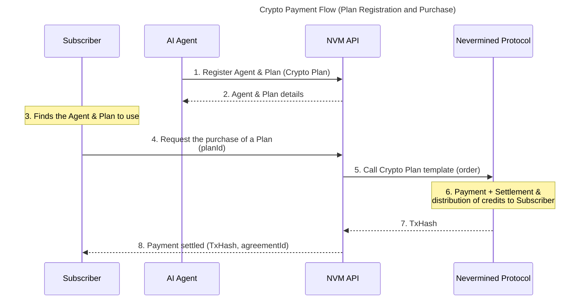

# Crypto Payment Flow

This document describes how an AI Builder can set up a Crypto Payment Flow using Nevermined. This will allow consumers to pay with cryptocurrency (ERC20 or native token) and obtain credits giving access to the execution of requests by AI Agents.

This flow can be executed with or without a human in the loop, which makes it suitable for agent-to-agent scenarios, where an AI Agent owning a wallet or Smart Account can autonomously pay for the execution of requests by other AI Agents.

## Flow Diagram

**Steps:**

1. The AI Agent or the owner of the AI Agent requests the NVM API to register a Crypto Payment plan in Nevermined. The plan includes the price in cryptocurrency and the credits obtained by the purchase. The owner associates the payment plan with the AI Agent.
2. The NVM API responds with the details of the registered plan, including a unique plan ID and agent ID.
3. The Subscriber finds the AI Agent and the associated Plan.
4. The Subscriber requests the NVM API to purchase the Payment Plan.
5. The NVM API interacts with the Nevermined Protocol by calling the Crypto Payment template's `order` method.
6. The Nevermined Protocol processes the payment transaction, settles the payment, and distributes the corresponding credits to the Subscriber.
7. The NVM Protocol returns a transaction hash (TxHash) to the NVM API as proof of payment.
8. The NVM API confirms to the Subscriber that the payment has been settled, providing the TxHash and `agreementId` as proof of payment.

## Crypto Payment Template

The Crypto payment flow is implemented using the `FixedPaymentTemplate` in Nevermined. This template allows capturing the cryptocurrency payment, settling it on-chain, and distributing the credits.

Because the payment is done directly on-chain using cryptocurrency, the validation and settlement are handled automatically by the smart contract without requiring additional authorization roles.

To implement this flow, this template involves the following conditions:

- Lock condition: Locks the payment amount in the agreement.
- Credits Distribution condition: Distributes the credits to the Subscriber.
- Crypto Payment condition: Validates and processes the cryptocurrency payment.
