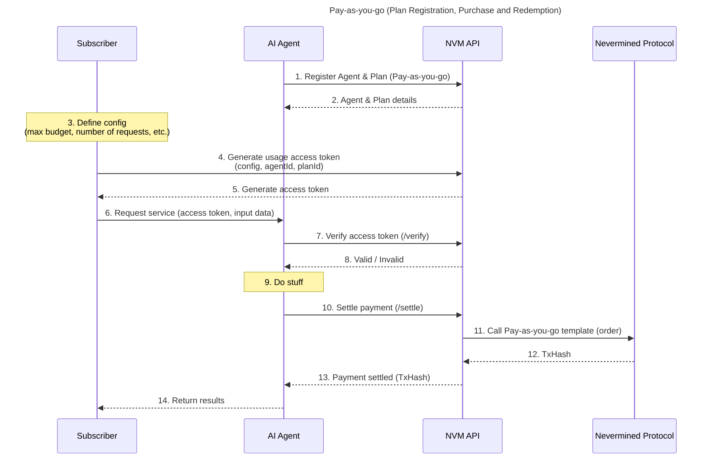

# Pay-as-you-go Payment Flow (Crypto)

This document describes the Pay-as-you-go Payment Flow supported by Nevermined.
The main use case of this flow is to allow consumers to pay directly with crypto for the execution of requests by AI Agents.

## Flow Diagram

This flow includes:

1. The registration of a Pay-as-you-go plan by the AI Agent or the owner of the AI Agent.
2. The direct usage of the AI Agent by the Subscriber, which includes the payment and settlement of each request.

**Steps:**

1. The AI Agent or the owner of the AI Agent requests the NVM API to register a Pay-as-you-go plan in Nevermined. The plan includes the price per request and other relevant details. The owner associates the payment plan with the AI Agent.
2. The NVM API responds with the details of the registered plan, including a unique plan ID and agent ID.
3. The Subscriber (once they have selected the AI Agent to use) defines the usage configuration. This includes things like max budget, number of requests, and other relevant parameters. The Subscriber will generate an access token restricting usage within these limits. After this access token is used (for example, the max budget is reached), the Subscriber will need to generate a new access token to continue using the service.
4. The Subscriber requests the NVM API to generate a usage access token, providing the configuration and the agent ID and plan ID.
5. The NVM API generates an access token that encodes the usage configuration and returns it to the Subscriber.
6. The Subscriber sends a request to the AI Agent, including the access token and any necessary input data for the request. The access token can be sent via the HTTP `Authorization` or `X-Payment` headers.
7. The AI Agent verifies the access token by calling the NVM API's `/verify` endpoint, providing the access token for validation.
8. The NVM API checks the validity of the access token, ensuring it has not expired and that the usage limits have not been exceeded. The validation can be done using the ZeroDev project's bundler RPC via `eth_estimateUserOperationGas`. It responds to the AI Agent with a validation result (valid or invalid).
9. If the access token is valid, the AI Agent processes the request and performs the necessary computations or actions. If the access token is invalid, the AI Agent rejects the request and informs the Subscriber.
10. After processing the request, the AI Agent calls the NVM API's `/settle` endpoint to settle the payment for the request. For this, it uses the access token given by the Subscriber.
11. The NVM API interacts with the Nevermined Protocol to create a payment agreement and execute the payment transaction. To do this, it uses the Pay-as-you-go payment template.
12. The Nevermined Protocol processes the payment transaction and returns a transaction hash (TxHash) to the NVM API.
13. The NVM API confirms to the AI Agent that the payment has been settled, providing the TxHash and `agreementId` as proof of payment.
14. Finally, the AI Agent returns the results of the request to the Subscriber, along with the payment confirmation details.

## Pay-as-you-go Template

The Pay-as-you-go payment flow is implemented using the Pay-as-you-go payment template in Nevermined. This template allows the capture of usage-based payments, where the Subscriber pays for each request made to the AI Agent. Because the flow is encapsulated in the same request from the Subscriber to the AI Agent, and to avoid using unnecessary gas, this template will not mint/burn credits and will only involve the following conditions:

- Lock payment condition: Locks the payment amount specified in the payment plan.
- Distribute payment condition: Distributes the locked payment to the AI Agent, subtracting the fees.
