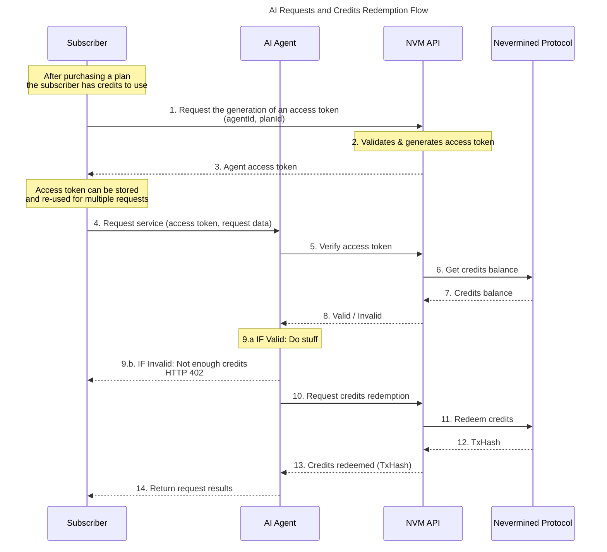

# AI Agent Requests and Redemption Flow

This document describes how a Subscriber can make requests to an AI Agent and how the payment and settlement of these requests are handled using Nevermined.

Because most of the payment flows result in the generation of credits that can be used to account for the requests a subscriber can make, this "consumption" flow is common to them. Specifically:

1. **Crypto Payment Flow** - After purchasing a Crypto Payment Plan, the Subscriber will have credits that can be used to pay for requests to the AI Agent.
2. **Fiat Payment Flow** - After purchasing a Fiat Payment Plan, the Subscriber will have credits that can be used to pay for requests to the AI Agent.
3. **Subscription Payment Flow** - After purchasing a Subscription Payment Plan, the Subscriber will have credits that can be used to pay for requests to the AI Agent. These credits will expire eventually depending on the subscription period.

This flow **does not apply to the Pay-as-you-go Payment Flow**, which is described in its own document. This is because the Pay-as-you-go flow does not involve the generation of credits; payment and settlement are done directly for each request.

## Flow Diagram

The first 3 steps generate an access token. This access token generation doesn't need to be performed per request; it can be stored and re-used multiple times to make the flow more efficient.

**Steps:**

1. The Subscriber (after purchasing a Payment Plan) requests the NVM API to generate an access token for the AI Agent they want to use. The request includes the agent ID and plan ID.
2. The NVM API validates the request, ensuring that the Subscriber has enough credits. The API generates an access token that encodes the agent ID, plan ID, and other relevant information.
3. The NVM API returns the access token to the Subscriber. The Subscriber can store the access token and include it in subsequent requests to the AI Agent, along with the request data.
4. The Subscriber makes a request to the AI Agent, including the access token and any necessary input data for the request. The access token can be sent via the HTTP `Authorization` or `X-Payment` headers.
5. The AI Agent verifies the access token by calling the NVM API.
6. The AI Agent reads the credits balance of the Subscriber for the Agent Plan by calling the NVM Protocol.
7. The NVM Protocol returns the credits balance to the NVM API.
8. The NVM API returns whether the access token is valid or invalid. The access token is considered valid if it has not expired and the Subscriber has enough credits to cover the request.
9. If the access token is valid (**9.a**), the AI Agent processes the request and performs the necessary actions. If the access token is invalid (**9.b**), the AI Agent returns an error indicating that there are not enough credits.
10. After processing the AI request, the AI Agent calls the NVM API to redeem the credits for the AI request.
11. The NVM API interacts with the Nevermined Protocol to redeem the credits and execute the payment transaction.
12. The Nevermined Protocol processes the credit redemption and returns a transaction hash (TxHash) to the NVM API.
13. The NVM API confirms to the AI Agent that the credits have been redeemed, providing the TxHash as proof of redemption.
14. The AI Agent returns the results related to the AI task, along with the TxHash.

## Dynamic Cost per Request

Nevermined allows the definition of Payment Plans that have a dynamic cost per request (in credits). This means that the cost of each request can vary based on different factors, such as the complexity of the request, the amount of data processed, or any other relevant metric.

When a Payment Plan has a dynamic cost per request, the AI Builder will provide the minimum and maximum cost per request when registering the plan. The actual cost per request will be determined at the time of the request by the AI Agent, based on the specific characteristics of the request.

When the Plan has a dynamic cost per request, the flow described above will allow the definition of the number of credits to redeem. This number of credits must be within the range defined by the plan (minimum and maximum cost per request).
