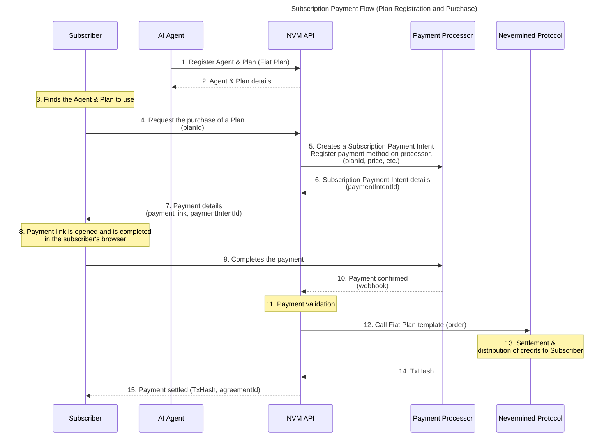

# Subscription Payment Flow (Fiat)

This document describes how an AI Builder can set up a Subscription Payment Flow using Nevermined. A subscription allows users to make automatic recurrent payments, allowing them to set up the payment once and make continuous usage of the AI Agents associated with the Payment Plan.

This flow is designed to work with a payment provider (e.g., Stripe, PayPal, etc.) for the payment of the Plan. Because the payment in fiat requires direct human interaction (typical browser payment flow), the payment flow (not the usage of the plan or agent requests) is designed to have a human in the loop.

The payment of the payment plan, which happens off-chain, will result in an on-chain settlement and the minting of credits that can be used to pay for requests to the AI Agent.

## Flow Diagram

**Steps:**

1. The AI Agent or the owner of the AI Agent requests the NVM API to register a Subscription Payment plan in Nevermined. The plan includes the price in fiat currency, the recurrence of the payment (e.g., monthly, yearly), and the credits obtained by the purchase. The owner associates the payment plan with the AI Agent.
2. The NVM API responds with the details of the registered plan, including a unique plan ID and agent ID.
3. The Subscriber finds the AI Agent and the associated Plan.
4. The Subscriber requests the NVM API to purchase the Subscription Plan.
5. The NVM API communicates with the Payment Processor (i.e., Stripe). It generates the subscription payment intent including the plan price, payment recurrence, and the fee. It also registers the payment method to be used for the recurrent payments.
6. The Payment Processor returns the payment intent details to the NVM API, including a unique payment intent ID and a payment link (URL) that the Subscriber can use to complete the payment.
7. The NVM API returns the Payment Intent details to the Subscriber.
8. The Subscriber opens the payment link in their browser and completes the payment using their preferred payment method (e.g., credit card).
9. The Subscriber sends the payment information to the Payment Processor to complete the transaction.
10. The Payment Processor processes the payment and returns the payment status to the NVM API via webhook call.
11. The NVM API verifies the payment confirmation.
12. If the payment was successful, the API interacts with the `FiatPaymentTemplate.order` method to settle the payment.
13. The NVM Protocol validates the request, settles the payment, and distributes the corresponding credits to the Subscriber.
14. The NVM Protocol returns a transaction hash (TxHash) to the NVM API as proof of payment.
15. The NVM API confirms to the AI Agent that the payment has been settled, providing the TxHash and `agreementId` as proof of payment.

## Subscription Payment Template

The Subscription payment flow in fiat is implemented using the `SubscriptionPaymentTemplate` in Nevermined. This template allows capturing the confirmation provided by the Payment Processor, settling the off-chain payment on-chain, and distributing the credits.

NOTE: Because the Payment Processor (e.g., Stripe) doesn't provide a cryptographic proof of payment, the NVM Protocol authorizes settling the payment only to the wallets belonging to the NVM INFRA Role.

To implement this flow, this template involves the following conditions:

- Fiat Settlement condition: Authorizes the NVM INFRA Role to settle the payment.
- Credits Distribution condition: Distributes the credits to the Subscriber.

### Overage Policy

A subscription plan can include an overage policy that allows the Subscriber to continue using the AI Agent even if the credits obtained by the subscription are exhausted. The overage policy defines the terms and conditions for this additional usage, including any extra fees that may apply.

To support this, the Subscription Plan will have an additional overage configuration including:

- Overage price per request: The cost for each additional request made beyond the included credits.
- Overage token (ERC20 or native): The address of the token to be used for the overage payments.

If subscribers exceed the credits obtained by the subscription, they can continue using the AI Agent by paying for each additional request according to the overage policy. The payment for these additional requests will be handled in a pay-as-you-go manner, ensuring a seamless experience for the Subscriber.

To support this, the `SubscriptionPaymentTemplate` contract will include an additional method `overage` that will allow the settlement of the overage payments. This method will do the following:

1. Validate that the subscriber purchased a subscription plan that includes an overage policy. Validate that the subscriber has exceeded the credits obtained by the subscription and doesn't have enough credits.
2. Lock the overage payment amount specified in the overage policy.
3. Distribute the locked payment to the AI Agent, subtracting the fees.

### Access Token with Overage

NOTE: This can be abstracted via the addition of the overage method with the Smart Accounts.

When a Subscriber requests an access token for a Subscription Plan that includes an overage policy, the generated access token will include the overage configuration. This allows the AI Agent to understand the terms of the overage and apply them accordingly.
