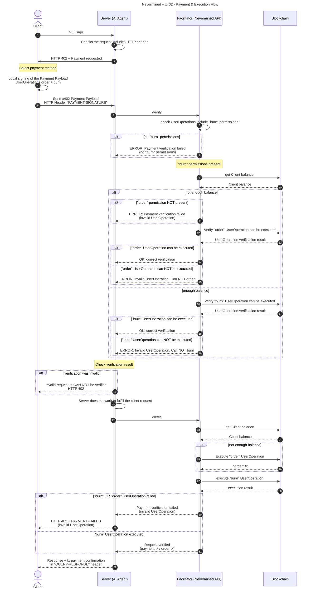

# Nevermined integration with x402 protocol

```
Date: 11.Nov.2025
Status: Work in Progress
Version: 0.2
```

## Summary

The [x402 protocol](https://x402.org/) brought attention to a previously unaddressed problem: payments between agents. Nevermined has been working on this challenge for a long time, well before it became a popular topic, but the x402 team put it in the spotlight with an open protocol leveraging digital native payments (web3).

Nevermined has a flexible architecture that allows us to integrate different payment methods (fiat and crypto) in a modular way. Supporting the x402 protocol is a natural fit for the Nevermined product. One key benefit of integrating x402 with Nevermined is the ability to provide enhanced use cases for builders and clients. While x402 is built on top of stablecoin payments (ERC20 contracts implementing EIP-3009 like USDC), Nevermined is built on top of a settlement layer provided by Smart Contracts. This means that with Nevermined we can support flexible use cases like subscription plans, credit plans, time-based plans, etc. This flexibility allows builders to create more complex and tailored solutions for their clients.

Nevermined has been exploring how to integrate the x402 protocol with our existing architecture. The goal is to leverage the strengths of both systems to provide a seamless payment experience for users while maintaining the flexibility and robustness of Nevermined's Smart Contract-based settlement layer.

## x402 Architecture: High-Level Overview

- x402 is a protocol that facilitates crypto payments for AI Agents and APIs
- It is based on the concept of pay-per-request to an API
- x402 is based on a local signature generated by the client, which represents an ERC20 payment
- ERC20 payments require the Smart Contract used for the payment (e.g., USDC) to implement `EIP-3009` to receive the signature generated off-chain by the client
- The facilitator (orchestrated/proxied by the Server/Agent) is able to verify and settle the payment on behalf of the client

## Differences Between x402 and Nevermined

Key differences between x402 and Nevermined worth highlighting:

- **Payment Authorization**: Where x402 is based on EIP-3009 authorization that allows ERC20 payments, Nevermined is based on Smart Contract interactions that allow programmable and more complex use cases.
- **Wallet Technology**: x402 uses standard wallets for signing payment authorization. Nevermined uses Smart Accounts (ERC-4337), leveraging the concept of UserOperations and Session Keys for representing interactions between users and Smart Contracts. Nevermined also uses Smart Account Policies to enforce rules like spending limits, number of requests, etc.
- **Payment Models**: x402 is focused on pay-per-request payments. Nevermined supports different payment plans like subscriptions, credit plans, time-based plans, etc.
- **Purchase vs. Usage**: Nevermined separates the purchase of something from the usage of it. For example, a client can purchase a credit plan and then redeem credits to access resources. x402 is more focused on direct payments for each request.

## Nevermined Integration with x402

The motivation for this integration is to use the x402 mechanism as a payment method, augmenting it with the functionality provided by Nevermined based on Smart Contracts (subscriptions, credit & time plans, etc.).

To achieve this we propose the following solution:

- This flow MUST be compatible with the existing x402 protocol, so it can be used by existing x402 clients and servers/agents.
- The interactions between the Client, Server/Agent and Facilitator MUST follow the same flow as x402 protocol.
- The payload MUST follow the x402 Payment Payload structure.
- This flow SHOULD be encapsulated in a new **x402 extension** called `smart-account` (or alternative name) which can be used to represent any Smart Contract interaction.
- The flow MUST leverage `ERC-4337` and the concept of `UserOperations` and `Session Keys` to represent the interactions between the Client and the Smart Contracts.
- The facilitator MUST be able to verify Client `UserOperations`/Session Keys and settle them as part of the flow.
- The high-level architecture (and the usage of the new scheme) using `ERC-4337` MUST be generic and independent of Nevermined, so it can be reused by other protocols.
- Leveraging `ERC-4337`, allows the local signing of [UserOperations](https://eips.ethereum.org/EIPS/eip-4337#the-useroperation-structure) which can be bundled as Session Keys and forwarded to a facilitator and submitted by it as a paymaster.
- The User Operations (and the Session Keys bundling them) will represent the interactions between users and Smart Contracts (purchase plan, redeem credits, etc.)
- Session Keys and User Operations can include limitations and permissions to enforce rules like spending limits, number of requests, etc.
- The Client can include several Session Keys representing different delegated permissions, all of them signed locally by the Client and forwarded to the facilitator as part of the x402 Payment Payload.
- The specific x402 Payload (using the new x402 extension) can be serialized in `base64` and sent from the user side (client) to the server/agent side, which will forward it to the facilitator.
- The flow remains the same as x402, but the message signed locally by the Client represents a different on-chain interaction. While in the x402 "exact" scheme the payload includes an EIP-3009 signature used to authorize an ERC-20 token transfer, in this case ("smart-account" extension) the Client signs a payload including the session keys and ERC-4337 `UserOperation`s defining the permissions delegated to the facilitator for the execution of Smart Contract interactions on behalf of the client.

### Payment & Execution Flow

The full flow using using a x402 extension for Smart Contract interactions would be as follows: 

https://www.mermaidchart.com/d/657f2f52-a84f-4492-9099-b9a8e1d24950



Steps:

1. Client makes an HTTP request to a Server (AI Agent).
2. The Server checks if the request includes a valid payment in the `PAYMENT-SIGNATURE` header.
3. If not the Server responds with a `HTTP 402 Payment Required` status and a Payment Required Response JSON object in the response body.
4. The client:

- Client selects one of the paymentRequirements (planId) returned by the server response and creates a Payment Payload based on the scheme of the paymentRequirements they have selected.
- Client creates and signs locally a `UserOperation` representing the Payment Intent (using `EIP-4337` and `EIP-712`).

5. Client sends a HTTP request to the server including the x402 Payment Payload and the signed `UserOperation`s in a new HTTP header called `PAYMENT-SIGNATURE`.
6. Server validates the incoming data and forward the `PAYMENT-SIGNATURE` value to the facilitator to verify the Client request.
7. Facilitator checks the request and confirm if it includes "burn" permissions
8. IF the request DOES NOT include "burn" permissions:
   - Facilitator rejects the request and return an error to the server.
   - Server returns to the client a `HTTP 402 PAYMENT-FAILED` response.
9. IF the request INCLUDES "burn" permissions, the Facilitator queries the blockchain to check the Client balance.
10. Blockchain returns the Client balance to the Facilitator.
11. Facilitator checks if the "order" User Operation is included. IF the "order" is NOT included:

- Facilitator rejects the request and return an error to the server.
- Server returns to the client a `HTTP 402 PAYMENT-FAILED` response.

12. IF the "order" UserOperation is included, the Facilitator verifies if the "order" UserOperation can be executed.
13. Blockchain returns the order verification result to the Facilitator.
14. IF the "order" UserOperation verification is Correct, the Facilitator confirms to the server that the verification is correct.
15. IF the "order" UserOperation verification is INVALID, the Facilitator returns an error to the server.

16. IF the Client has enough balance, the Facilitator verifies if the "burn" UserOperation can be executed.
17. The Blockchain returns the burn verification result to the Facilitator.
18. IF the "burn" UserOperation verification is Correct, the Facilitator confirms to the server that the verification is correct.
19. IF the "burn" UserOperation verification is INVALID, the Facilitator returns an error to the server.

20. The Server after obtain the verification result from the Facilitator (and BEFORE executing any task), checks the verification result. If the verification was INVALID, the Server returns to the client a `HTTP 402 PAYMENT-FAILED` response. If the verification was correct, the Server continues with the request execution.
21. The Server executes the task to fulfill the client request (AI Task or anything necessary).
22. The Server calls the `/settle` endpoint of the Facilitator to settle the request

23. Facilitator queries the blockchain to check the Client balance.
24. Blockchain returns the Client balance to the Facilitator.
25. IF the Client does NOT have enough balance, the Facilitator executes the "order" UserOperation on behalf of the Client.
26. Blockchain returns the "order" tx to the Facilitator.
27. Facilitator executes the "burn" UserOperation on behalf of the Client.
28. Blockchain returns the execution result to the Facilitator.
29. IF the "burn" OR "order" UserOperations execution FAILED, the Facilitator rejects the request and return an error to the server.
30. The Server returns to the client a `HTTP 402 PAYMENT-FAILED` response.
31. If the "burn" UserOperation executed successfully, the Facilitator confirms to the server that the request is verified (including the payment tx / order tx).
32. Server returns to the client the tx payment confirmation in the `QUERY-RESPONSE` header.

## Messages Between Client, Server and Facilitator

The messages exchanged between the Client, Server and Facilitator are as follows:

- They use the standard **x402 Payment Payload** structure with a new extension called `smart-account`.
- The "payload" field includes the `signature` field that contains the EIP-712 signature generated locally by the Client.
- The "sessionKeys" includes the array of session keys representing the permissions delegated by the Client to the Facilitator.

### Payment Payload Schema

#### JSON Structure

The client includes payment authorization as JSON in the payment payload field:

```json
{
  "x402Version": 2,
  "scheme": "exact",
  "network": "base-sepolia",
  "extensions": {
    "smart-account": {
      "signature": "EIP-712 signature of the Payment Payload",
      "authorization": {
        "provider": "zerodev",
        "sessionKeys": [
          {
            "id": "order",
            "data": "session-key-data-for-order-permission"
          },
          {
            "id": "redeem",
            "hash": "hash-of-session-key-data-for-redeem-permission"
          }
        ]
      }
      
    }
  },
  "payload": {}
}
```

#### Field Descriptions

The `PaymentPayload` schema contains the following fields:

**All fields are required.**

| Field Name    | Type     | Description                                                              |
| ------------- | -------- | ------------------------------------------------------------------------ |
| `x402Version` | `number` | Protocol version identifier (must be 2)                                  |
| `scheme`      | `string` | Payment scheme identifier (must be "exact")                              |
| `network`     | `string` | Blockchain network identifier (e.g., "base-sepolia", "ethereum-mainnet") |
| `extensions`  | `object` | Data object including the `smart-account` extension                      |
| `payload`     | `object` | Payment data object                                                      |

The `extensions` object will contain a `smart-account` object with scheme-specific data (using EIP-712 format):

**All fields are required.**

| Field Name     | Type       | Description                       |
| -------------- | ---------- | --------------------------------- |
| `signature`     | `string`  | The signature of the x402 payload |
| `authorization` | `object`  | An array of session keys          |

The `authorization` object contains the following fields: 
**All fields are required.**

| Field Name     | Type       | Description                       |
| -------------- | ---------- | --------------------------------- |
| `provider`     | `string`   | The provider for the session keys |
| `sessionKeys` | `object[]` | An array of session keys          |

The **SessionKey** object contains the following fields:

The **id** field is required. The **data** or **hash** fields must be completed:
a. If the **data** field is provided, the **hash** field can be omitted. The data field represents the b64 encoded session key, that can be used by the facilitator to reconstruct and verify the session key used to execute the UserOperations.
b. If the **data** is not provided, the **hash** field must be provided. The hash field represents the keccak256 hash of the b64 encoded session key. This assumes the Facilitator has a way to recover the session key (stored off-chain) from the hash.


| Field Name     | Type       | Description                       |
| -------------- | ---------- | --------------------------------- |
| `id`     | `string`   | The id of the session key (e.g. "order", "redeem") |
| `data` | `string` | The b64 encoded session key          |
| `hash` | `string` | The keccak256 hash of the b64 encoded session key          |
