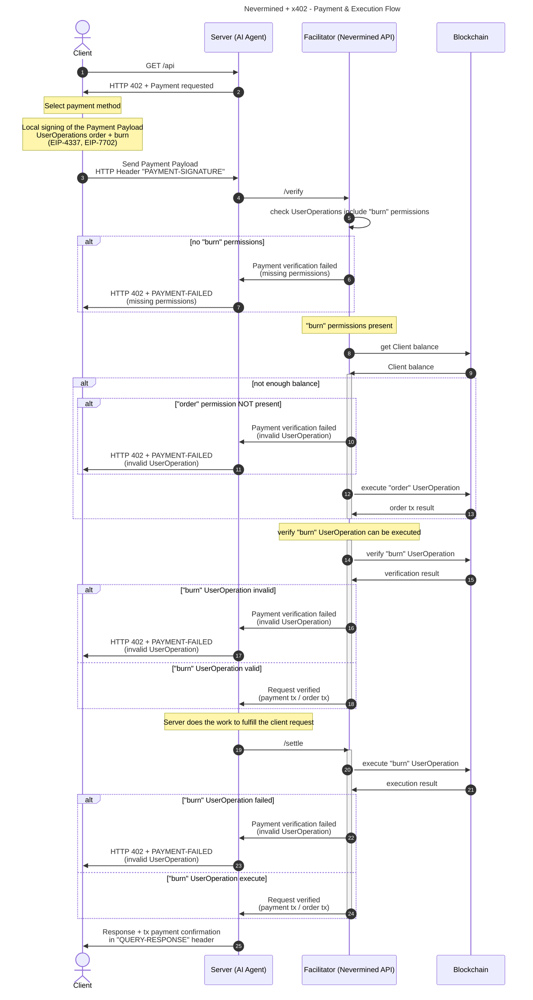

# Nevermined integration with x402 protocol

## Summary

The [x402 protocol](https://x402.org/) brought attention to a problem that was not addressed before, the payments between agents. In Nevermined we have been working about that for a long time, way before that was a cool problem, but it was x402 folks who put it in the spotlight. And it does with an open protocol and leveraging digital native payments (web3).

In Nevermined we have a flexible architecture that allows us to integrate different payment methods (fiat and crypto) in a modular way. And we think supporting x402 protocol makes a natural fit in Nevermined product. One key benefit of integrating x402 with Nevermined is the ability to provide better use cases for builders and clients. Where x402 is built on top of stablecoin payments (ERC20 contracts implement EIP-3009 like USDC), Nevermined is built on top of a settlement layer provided by Smart Contracts. This means with Nevermined we can support flexible use cases like subscription plans, credit plans, time plans, etc. This flexibility allows builders to create more complex and tailored solutions for their clients.

In Nevermined we have been exploring how to integrate x402 protocol with our existing architecture. The goal is to leverage the strengths of both systems to provide a seamless payment experience for users while maintaining the flexibility and robustness of Nevermined's Smart Contract-based settlement layer.

## x402 architecture, high level overview

- x402 is a protocol that facilitates crypto payments for AI Agents and APIs
- It's based in the concept of pay-per-request to an API
- x402 is based in a local signature generated by the client which represents a ERC20 payment
- ERC20 payments require the Smart Contract used for the payment (i.e USDC) to implement the `EIP-3009` to receive the signature generated off-chain by the client
- The facilitator (orchestrated/proxied by the Server/Agent) is able to "verify" and "settle" the payment on behalf of the client

## Differences between x402 and Nevermined

Some differences between x402 and Nevermined worth to highlight:

- Where x402 is based in a EIP-3009 authorization that allows ERC20 payments, Nevermined is based in Smart Contract interactions that allow programmable and more complex use cases.
- x402 uses standard wallets for signing the payment authorization. Nevermined uses Smart Accounts (ERC-4337), and leverage the concept of UserOperations for representing the interactions between users and Smart Contracts. Nevermined also use account policies to enforce rules like spending limits, number of requests,etc.
- x402 is focused in pay-per-request payments. Nevermined supports different payment plans like subscriptions, credit plans, time plans, etc.
- Nevermined separates the purchase of something of the usage of it. For example, a client can purchase a credit plan and then redeem credits to access resources. x402 is more focused in direct payments for each request.

## Nevermined integration with x402

The motivation of this integration is to use x402 mechanism as method of payment, and augmenting it with the functionality provided by Nevermined based on Smart Contracts (subscription, credit & time plans, etc).

To achieve this we propose the following solution:

- Leveraging `ERC-4337`, allow the local signing of [UserOperations](https://eips.ethereum.org/EIPS/eip-4337#the-useroperation-structure) which can be forwarded to a facilitator and submitted by it as a paymaster.
- The User Operations will represent the interactions between the users and the Smart Contracts (purchase plan, redeem credits, etc.)
- The specific `UserOperation` generates a hash that can be sent from the user side (client) to the server/agent side, which will forward it to the facilitator as part of the x402 Payment Payload.
- The flow stays the same as x402, but the message signed locally by the Client represents a different on-chain interaction. While in x402 it uses a EIP-3009 signature used to authorize a ERC-20 token transfer, in this case the Client signs a EIP-712 message that includes the ERC-4337 `UserOperation`s that delegate to the facilitator the execution of the Smart Contract interactions on behalf of the client.
- This can be encapsulated in a new x402 scheme called `contract` which can be used to represent any Smart Contract interaction.
- The facilitator will be able to `verify` Client `UserOperations` and `settle` them as part of the flow.
- The high-level architecture (and the usage of the new scheme) using `ERC-4337` MUST be generic and independent of Nevermined, so it can be reused by other protocols.

### Payment & Execution Flow



Steps:

1. Client makes an HTTP request to a resource server.
2. Resource server responds with a `HTTP 402 Payment Required` status and a Payment Required Response JSON object in the response body.

- Client selects one of the paymentRequirements (planId) returned by the server response and creates a Payment Payload based on the scheme of the paymentRequirements they have selected.
- Client creates and signs locally a `UserOperation` representing the Payment Intent (using `EIP-4337` and `EIP-712`).

3. Client sends a HTTP request to the server including the Payment Payload and the signed `UserOperation`s in a new HTTP header called `PAYMENT-SIGNATURE`.
4. Server validates the incoming data and forward the `PAYMENT-SIGNATURE` value to the facilitator to verify the Client request.
5. Facilitator checks the request and confirm if it includes "burn" permissions
6. IF the request DOES NOT include "burn" permissions:
   - Facilitator rejects the request and return an error to the server.
   - Server returns to the client a `HTTP 402 PAYMENT-FAILED` response.
7. IF the request INCLUDES "burn" permissions, the Facilitator queries the blockchain to check the Client balance.
8. Blockchain returns the Client balance to the Facilitator.
9. Facilitator checks if the "order" User Operation is included
10. IF the "order" is NOT included:

- Facilitator rejects the request and return an error to the server.
- Server returns to the client a `HTTP 402 PAYMENT-FAILED` response.

13. IF the "order" UserOperation is included, the Facilitator executes the "order" UserOperation on behalf of the Client.
14. Blockchain returns the order transaction result to the Facilitator.
15. Facilitator simulates the "burn" UserOperation to ensure it can be executed successfully.
16. Blockchain returns the simulation result to the Facilitator.
17. IF the "burn" UserOperation is verification is INVALID:

- Facilitator rejects the request and return an error to the server.
- Server returns to the client a `HTTP 402 PAYMENT-FAILED` response.
- IF NOT, the Facilitator confirms to the server that the request is verified (including the payment tx / order tx).

20. The Server after verifying the Client request (and AFTER executing the Task), calls the `/settle` endpoint of the Facilitator to settle the request
21. Facilitator executes the "burn" UserOperation on behalf of the Client.
22. Blockchain returns the execution result to the Facilitator.
23. IF the "burn" UserOperation execution FAILED:

- Facilitator rejects the request and return an error to the server.
- Server returns to the client a `HTTP 402 PAYMENT-FAILED` response.

25. IF the "burn" UserOperation executed successfully, the Facilitator confirms to the server that the request is verified (including the payment tx / order tx).
26. Server returns to the client the tx payment confirmation in the `QUERY-RESPONSE` header.

## Messages between Client, Server and Facilitator

The messages exchanged between the Client, Server and Facilitator are as follows:

- They are composed using EIP-712 standard for typed structured data hashing and signing.
- The payload includes an `user-operations` array that contains the `UserOperation` objects representing the actions to be performed on behalf of the client.
- Each `UserOperation` permissions use ([EIP-4337 UserOperation structure](https://eips.ethereum.org/EIPS/eip-4337#the-useroperation-structure)) that includes the necessary data to perform the action.

```typescript
struct PermissionsBundle {
    address account;        // ERC-4337 smart account
    address sessionKey;     // key the agent will use to sign UserOperations
    uint256 nonce;          // bundle-level nonce
    uint48 validAfter;      // bundle validity window
    uint48 validUntil;
    UserPermission[] permissions;
}

struct UserPermission {
    address target; // contract you’re allowed to call
    bytes4 selector; // 4-byte function selector
    uint256 maxValue;     // max ETH value (or token amount / abstract units)
    uint48 validAfter;    // time window
    uint48 validUntil;    // time window
    uint16 maxCalls;      // upper bound on how many times this permission may be used
}

```
