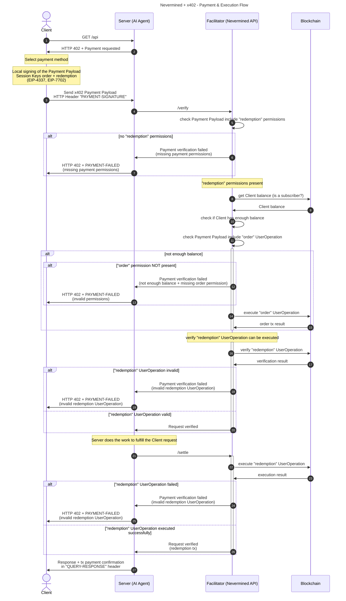

# Nevermined integration with x402 protocol

```
Date: 11.Nov.2025
Status: Work in Progress
Version: 0.2
```


## Summary

The [x402 protocol](https://x402.org/) brought attention to a previously unaddressed problem: payments between agents. Nevermined has been working on this challenge for a long time, well before it became a popular topic, but the x402 team put it in the spotlight with an open protocol leveraging digital native payments (web3).

Nevermined has a flexible architecture that allows us to integrate different payment methods (fiat and crypto) in a modular way. Supporting the x402 protocol is a natural fit for the Nevermined product. One key benefit of integrating x402 with Nevermined is the ability to provide enhanced use cases for builders and clients. While x402 is built on top of stablecoin payments (ERC20 contracts implementing EIP-3009 like USDC), Nevermined is built on top of a settlement layer provided by Smart Contracts. This means that with Nevermined we can support flexible use cases like subscription plans, credit plans, time-based plans, etc. This flexibility allows builders to create more complex and tailored solutions for their clients.

Nevermined has been exploring how to integrate the x402 protocol with our existing architecture. The goal is to leverage the strengths of both systems to provide a seamless payment experience for users while maintaining the flexibility and robustness of Nevermined's Smart Contract-based settlement layer.

## x402 Architecture: High-Level Overview

- x402 is a protocol that facilitates crypto payments for AI Agents and APIs
- It is based on the concept of pay-per-request to an API
- x402 is based on a local signature generated by the client, which represents an ERC20 payment
- ERC20 payments require the Smart Contract used for the payment (e.g., USDC) to implement `EIP-3009` to receive the signature generated off-chain by the client
- The facilitator (orchestrated/proxied by the Server/Agent) is able to verify and settle the payment on behalf of the client

## Differences Between x402 and Nevermined

Key differences between x402 and Nevermined worth highlighting:

- **Payment Authorization**: Where x402 is based on EIP-3009 authorization that allows ERC20 payments, Nevermined is based on Smart Contract interactions that allow programmable and more complex use cases.
- **Wallet Technology**: x402 uses standard wallets for signing payment authorization. Nevermined uses Smart Accounts (ERC-4337), leveraging the concept of UserOperations and Session Keys for representing interactions between users and Smart Contracts. Nevermined also uses Smart Account Policies to enforce rules like spending limits, number of requests, etc.
- **Payment Models**: x402 is focused on pay-per-request payments. Nevermined supports different payment plans like subscriptions, credit plans, time-based plans, etc.
- **Purchase vs. Usage**: Nevermined separates the purchase of something from the usage of it. For example, a client can purchase a credit plan and then redeem credits to access resources. x402 is more focused on direct payments for each request.

## Nevermined Integration with x402

The motivation for this integration is to use the x402 mechanism as a payment method, augmenting it with the functionality provided by Nevermined based on Smart Contracts (subscriptions, credit & time plans, etc.).

To achieve this we propose the following solution:

- This flow MUST be compatible with the existing x402 protocol, so it can be used by existing x402 clients and servers/agents.
- The interactions between the Client, Server/Agent and Facilitator MUST follow the same flow as x402 protocol.
- The payload MUST follow the x402 Payment Payload structure.
- This flow SHOULD be encapsulated in a new x402 scheme called `contract` (or alternative name) which can be used to represent any Smart Contract interaction.
- The flow MUST leverage `ERC-4337` and the concept of `UserOperations` and `Session Keys` to represent the interactions between the Client and the Smart Contracts.
- The facilitator MUST be able to verify Client `UserOperations`/Session Keys and settle them as part of the flow.
- The high-level architecture (and the usage of the new scheme) using `ERC-4337` MUST be generic and independent of Nevermined, so it can be reused by other protocols.
- Leveraging `ERC-4337`, allows the local signing of [UserOperations](https://eips.ethereum.org/EIPS/eip-4337#the-useroperation-structure) which can be bundled as Session Keys and forwarded to a facilitator and submitted by it as a paymaster.
- The User Operations (and the Session Keys bundling them) will represent the interactions between users and Smart Contracts (purchase plan, redeem credits, etc.)
- Session Keys and User Operations can include limitations and permissions to enforce rules like spending limits, number of requests, etc.
- The Client can include several Session Keys representing different delegated permissions, all of them signed locally by the Client and forwarded to the facilitator as part of the x402 Payment Payload.
- The specific x402 Payload (using the new "contract" scheme) can be serialized in `base64` and sent from the user side (client) to the server/agent side, which will forward it to the facilitator.
- The flow remains the same as x402, but the message signed locally by the Client represents a different on-chain interaction. While in the x402 "exact" scheme the payload includes an EIP-3009 signature used to authorize an ERC-20 token transfer, in this case ("contract" scheme) the Client signs a payload including the session keys and ERC-4337 `UserOperation`s defining the permissions delegated to the facilitator for the execution of Smart Contract interactions on behalf of the client.

### Payment & Execution Flow



Steps:

1. Client makes an HTTP request to a resource server.
2. Resource server responds with an `HTTP 402 Payment Required` status and a Payment Required Response JSON object in the response body.

- Client selects one of the payment requirements returned by the server response and creates a Payment Payload based on the scheme of the payment requirements they have selected.
- Client creates and signs locally an x402 Payment Payload including the Session Keys & User Operations representing the Payment Intent (using `EIP-4337`).

3. Client sends a HTTP request to the server including the Payment Payload and the signed `UserOperation`s/Session Keys in a new HTTP header called `PAYMENT-SIGNATURE`.
4. Server calls the `/verify` method of the facilitator to validate the incoming data and forwards the `PAYMENT-SIGNATURE` value to the facilitator to verify the Client request.
5. Facilitator checks the request and confirms if it includes "redemption" permissions.
6. IF the request DOES NOT include "redemption" permissions:
   - Facilitator rejects the request and returns an error to the server.
   - Server returns to the client an `HTTP 402 PAYMENT-FAILED` response.
8. IF the request INCLUDES "redemption" permissions, the Facilitator queries the blockchain to check if the Client is a subscriber.
9. Blockchain returns the Client balance to the Facilitator.
10. Facilitator checks if the Client has enough balance to cover the "redemption" User Operation.
11. Facilitator checks if the "order" User Operation is included.
12. IF the Client doesn't have balance AND the "order" is NOT included:

- Facilitator rejects the request and returns an error to the server.
- Server returns to the client an `HTTP 402 PAYMENT-FAILED` response.

14. IF the Client doesn't have balance BUT the "order" UserOperation is included, the Facilitator executes the "order" UserOperation on behalf of the Client.
15. Blockchain returns the order transaction result to the Facilitator.
16. Facilitator simulates the "redemption" UserOperation to ensure it can be executed successfully.
17. Blockchain returns the simulation result to the Facilitator.
18. IF the "redemption" UserOperation verification is INVALID:

- Facilitator rejects the request and returns an error to the server.
- Server returns to the client an `HTTP 402 PAYMENT-FAILED` response.

20. IF NOT, the Facilitator confirms to the server that the request is verified (including the payment tx/order tx).
21. The Server, after verifying the Client request (and AFTER executing the Task), calls the `/settle` endpoint of the Facilitator to settle the request.
22. Facilitator executes the "redeem" UserOperation on behalf of the Client.
23. Blockchain returns the execution result to the Facilitator.
24. IF the "redeem" UserOperation execution FAILED:

- Facilitator rejects the request and returns an error to the server.
- Server returns to the client an `HTTP 402 PAYMENT-FAILED` response.

26. IF the "redeem" UserOperation executed successfully, the Facilitator confirms to the server that the request is verified (including the payment tx/order tx).
27. Server returns to the client the tx payment confirmation in the `QUERY-RESPONSE` header.

## Messages Between Client, Server and Facilitator

The messages exchanged between the Client, Server and Facilitator are as follows:

- They use the standard x402 Payment Payload structure with a new scheme called `contract`.
- The "payload" field includes the `signature` field that contains the EIP-712 signature generated locally by the Client.
- The "session-keys" includes the array of session keys representing the permissions delegated by the Client to the Facilitator.

### Payment Payload Schema

```json
{
  "x402Version": 2,
  "scheme": "contract",
  "network": "base-sepolia",
  "payload": {
    "signature": "0x2d6a7588d6acca505cbf0d9a4a227e0c52c6c34008c8e8986a1283259764173608a2ce6496642e377d6da8dbbf5836e9bd15092f9ecab05ded3d6293af148b571c",
    "session-keys-provider": "zerodev",
    "session-keys": [
      {
        "id": "order",
        "data": "hash-of-session-key-data-for-order-permission"
      },
      {
        "id": "redeem",
        "data": "hash-of-session-key-data-for-redeem-permission"
      }
    ]
  }
}
```
